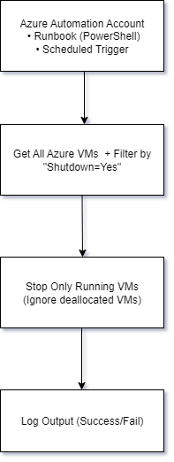

# 🔌 Automate VM Shutdown Based on Tags – Azure Runbook + PowerShell

## 📘 Overview
This project automates shutting down Azure VMs that have a specific tag (`Shutdown=Yes`) using a PowerShell-based Runbook in Azure Automation.

---

## 🧱 Architecture



---

## ⚙️ Tech Used
- Azure Automation Account
- PowerShell Runbook
- Azure Resource Graph (via Get-AzVM)
- Azure Tags
- Scheduled Jobs

---

## 💡 Use Case
Avoid unnecessary costs by automatically stopping test/dev VMs outside business hours.

---

## 🧪 How it Works
1. Azure Runbook runs on schedule (e.g., daily at 7:00 PM)
2. Connects using AzureRunAsConnection
3. Queries all VMs tagged with `Shutdown=Yes`
4. Shuts down those that are still running

---

## 🔐 PowerShell Script
```powershell
# Refer to Shutdown-Tagged-VMs.ps1 in this repo
